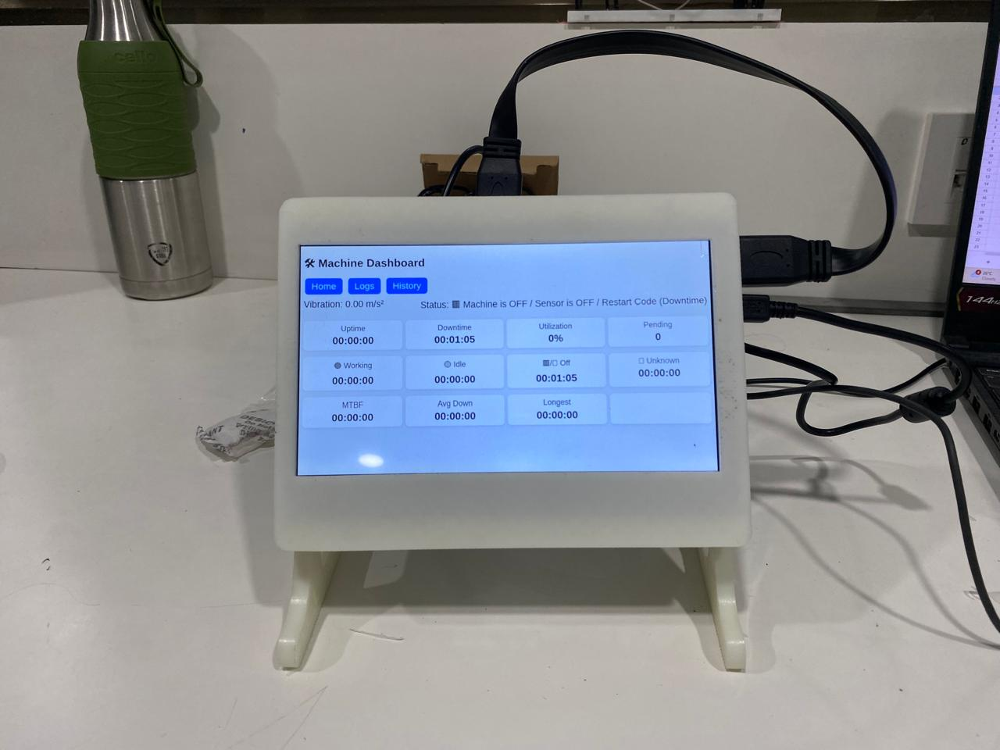
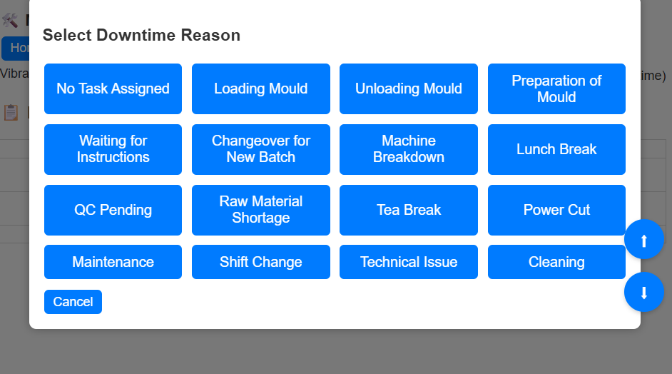
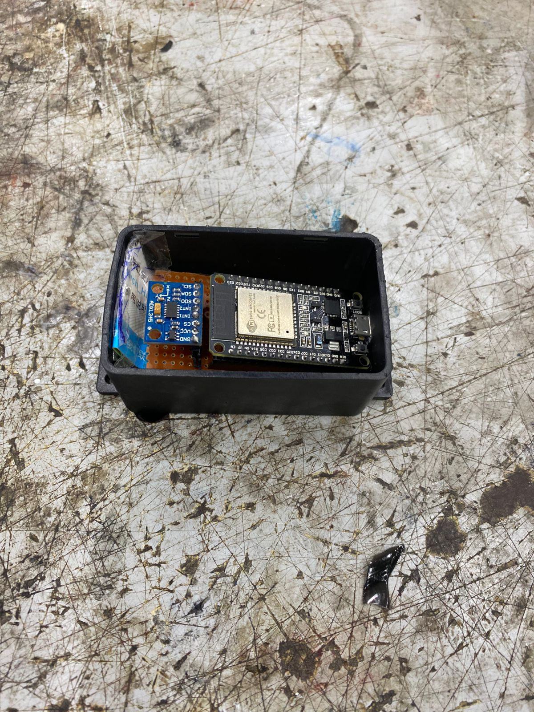
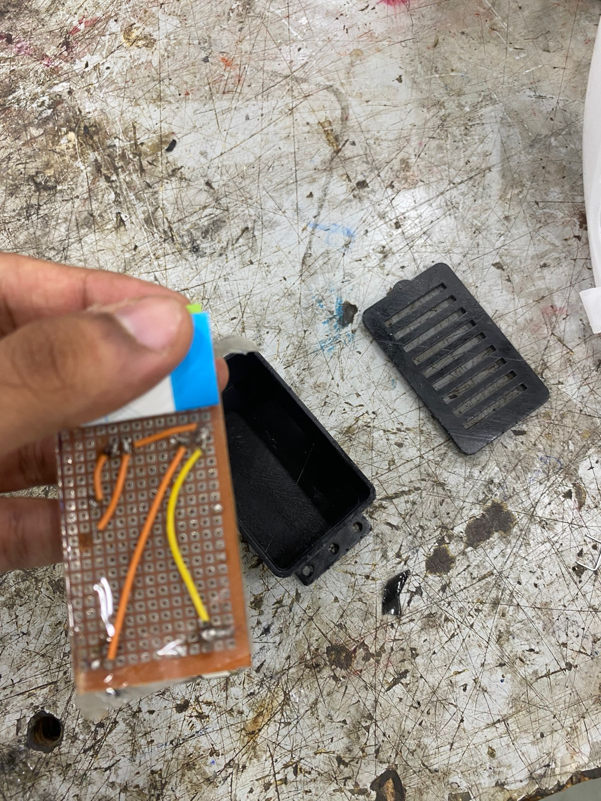
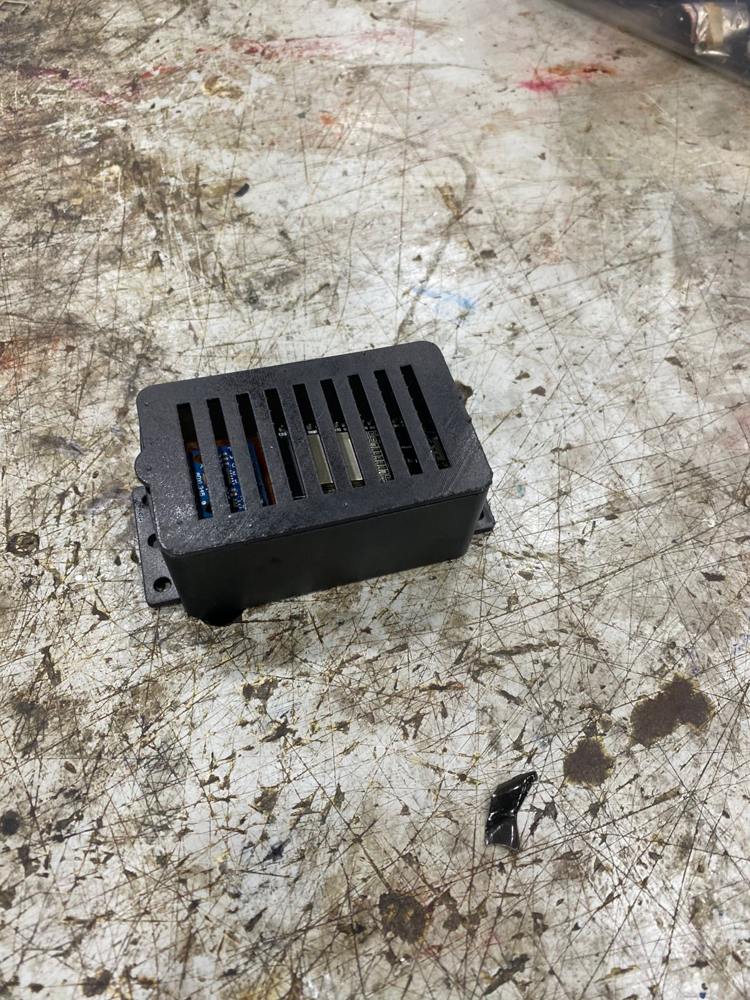
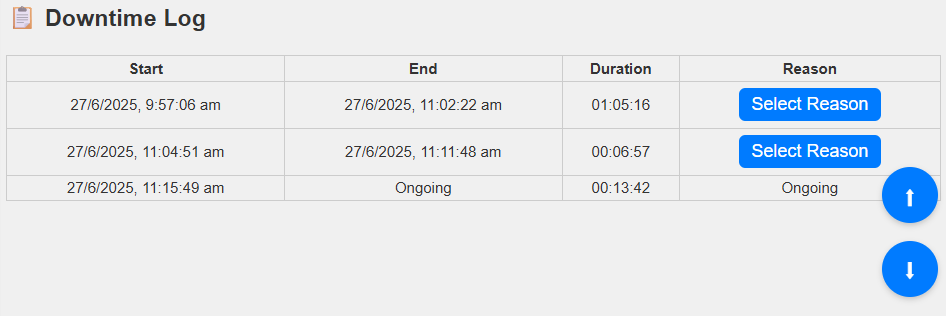
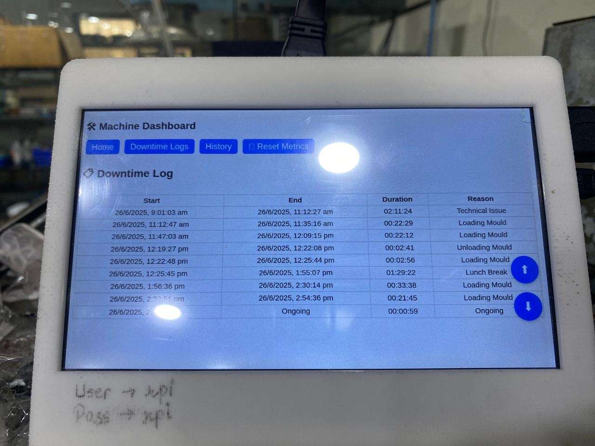

# Machine Monitoring System (ESP32 + MQTT + Flask)

An Industrial IoT machine monitoring system that measures machine vibration using an **ESP32 with an ADXL345 accelerometer**, transmits vibration data via **MQTT**, and processes it using a **Python backend**.  

The system provides a **Flask-based monitoring dashboard**, **Telegram alerts**, **downtime analytics**, and **Excel-based logging** for machine performance analysis.

This project is designed for **industrial machine monitoring, predictive maintenance, and production analytics in manufacturing environments**.

---

# System Dashboard

The monitoring dashboard provides real-time visualization of machine vibration and operational status.

  
  

The dashboard displays:

- Live vibration values
- Machine operational status
- Uptime and downtime
- Machine utilization percentage
- Historical machine data
- Operational analytics

---

# Telegram Alert System

The system integrates a **Telegram bot** to provide real-time alerts and remote monitoring.

Supported commands:

/status
/logs
/download
/summary

Example response:

Machine Status
Vibration: 1.34 m/s²
Status: Machine Working

Telegram interface examples:

  
  

---

# Hardware Setup

The monitoring device is built using an ESP32 microcontroller and an ADXL345 vibration sensor.

  
  
  

## Components

- ESP32 Development Board
- ADXL345 Accelerometer
- Jumper wires
- Power supply

---

# Wiring Configuration

| ADXL345 | ESP32 |
|--------|------|
| VCC | 3.3V |
| GND | GND |
| SDA | GPIO21 |
| SCL | GPIO22 |

---

# System Architecture

The system follows an IoT-based monitoring architecture:

ADXL345 Sensor
│
▼
ESP32 Microcontroller
│
▼
MQTT Broker
│
▼
Python Backend (Flask)
│
├── Web Dashboard
├── Excel Logging
└── Telegram Alerts

---

# ESP32 Firmware Features

The ESP32 firmware performs real-time vibration monitoring and reliable data transmission.

Features include:

- ADXL345 vibration sensing
- RMS vibration calculation
- MQTT data publishing
- Automatic WiFi reconnection
- Automatic MQTT reconnection
- Watchdog reset protection
- Local WebSocket vibration monitor
- Built-in debugging web interface

---

# Backend Monitoring System

The Python backend processes vibration data and provides machine monitoring analytics.

Features include:

- Real-time MQTT vibration monitoring
- Machine state detection:
  - Working
  - Idle
  - Off / Sensor Offline
- Automatic uptime and downtime calculation
- Downtime reason tracking
- Flask web dashboard
- Excel-based downtime logging
- JSON state persistence
- Daily analytics reports
- Machine utilization calculation
- MTBF (Mean Time Between Failures)
- Telegram alert integration
- Telegram command interface

---

# Machine Logs

The system automatically records machine activity and downtime events for analysis.

  
  

Logs are saved in:

backend/logs/

Example log file:

downtime_2026-03-10.xlsx

---

# MQTT Configuration

Example MQTT broker configuration:

Broker: z9fe****.ala.asia-southeast1.emqxsl.com
Port: 888*
TLS: Enabled

Topic used:

vibration/rms

---

# ESP32 Firmware Setup

Open the firmware using **Arduino IDE**.

Install required libraries:

- Adafruit ADXL345
- Adafruit Unified Sensor
- PubSubClient
- ESPAsyncWebServer
- AsyncTCP

Upload the firmware to the ESP32 board.

---

# Backend Setup

Install Python dependencies:

pip install -r backend/requirements.txt

Run the backend server:

python backend/app.py

The dashboard will be available at:

http://localhost:5000

---

# Daily Analytics

The system automatically generates daily machine analytics including:

- Machine utilization
- MTBF
- Average downtime
- Longest downtime
- Most frequent downtime reason

A daily summary report is also sent via **Telegram**.

---

# Watchdog Protection

The system includes reliability mechanisms to prevent system failures.
